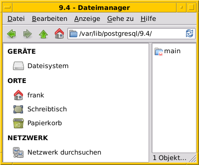
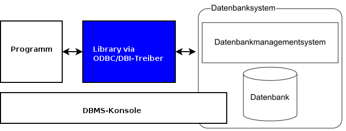

Datenbanken und Anwendungen (3 Tage)
====================================
:author:    Frank Hofmann <frank.hofmann@efho.de>
:backend:   slidy
:data-uri:  http://www.efho.de/
:max-width: 94%
:icons:

== Inhalt ==

* Ablauf
* Einführung
** Was ist eine Datenbank
** Ziel einer Datenbank
** Formate und Varianten
** Zugangswege
** Auswahlkriterien eines DBMS
** Speicherformen
* DBMS (Auswahl)
* Zugriff (allgemein)
* Ablauf eines Zugriffs auf eine Datenbank
* Datenbankaufträge
* Anwendung im Kurs
* Werkzeuge im Projekt 
* Ablauf -- Schritte 1 bis 8
* Anhang
** DBS-Kommandos

== Einführung ==

=== Was ist eine Datenbank ===

* Behälter zur Speicherung von Daten
* Behälter wird abgebildet als 
** gesamter Inhalt eines Speichermediums (Oracle DB)
** Datei im Dateisystem: `/var/lib/postgresql/version/main` (PostgreSQL)

=== DB vs DBS vs DBMS ===

DB:: Abkürzung für Datenbank ('database')

DBS:: Abkürzung für Datenbanksystem ('database system')

DBMS:: Abkürzung für Datenbank-Management-System ('database management system')

=== DBS-Formen ===

lokal:: alles auf einem einzigen Computer bzw. Speichermedium

verteilt ('distributed'):: über mehrere Computer und Speichermedien verteilt

== Ziel einer Datenbank ==

* Daten strukturiert speichern und wiederfinden
* Informationen erhalten
* Daten aggregieren
* Daten auswerten (in begrenztem Maße)

.Funktionen eines DBS (Auswahl)
[frame="topbot",options="header",cols="4,2",id="tab.datenbankfunktionen"]
|====
| Kategorie | Funktion 
| mathematische Funktionen | `sum()`, `avg()`, `count()`
| statistische Funktionen | `min()`, `max()`, `avg()`
| trigonometische Funktionen | `sin()`, `tan()`
|====

----
Ziel: Ziel und Aufgaben eines DBMS
----

== Formate und Varianten ==

=== Komma-separierte Werte (CSV) ===

* Speicherung als Tabelle mit einzelnen Spalten
* Trennzeichen als Spaltentrenner
** Leerzeichen
** Tabulator
** Komma
** Semikolon

.adressen.txt
----
Name;Strasse;Ort;Postleitzahl;Telefon
Rainer Zufall;Rathausplatz 15;Potsdam;14467;(0331) 123456
Holger Glück;Am Nordtor 5;Nauen;14641;
----

=== Text und Tabellen (ASCII oder Binär) ===

* speichert das DBMS
* Format legt das DBMS fest

----
==================================================================
|Name         |Strasse        |Ort    |Postleitzahl|Telefon      |
==================================================================
|Rainer Zufall|Rathausplatz 15|Potsdam|14467       |(0331) 123456|
|Holger Glück |Am Nordtor 5   |Nauen  |14641       |             |
==================================================================
----

=== Extended Markup Language (XML) ===

* Speicherung als Knoten und Knoteninhalte
* Knoten via `<knotenname>Inhalt</knotenname>`

.adressen.xml
----
<adressliste>
	<adresse>
		<name>Rainer Zufall></name>
		<strasse>Rathausplatz 15</strasse>
		<ort>Potsdam</ort>
		<postleitzahl>14467</postleitzahl>
		<telefon>(0331) 123456</telefon>
	</adresse>
	<adresse>
		<name>Holger Glück</name>
		<strasse>Am Nordtor 5</strasse>
		<ort>Nauen</ort>
		<postleitzahl>14641</postleitzahl>
		<telefon></telefon>
	</adresse>
</adressliste>
----

=== BLOB ===

* Abkürzung für 'binary large objects'
* Speicherung als Binärinhalt

=== JSON ===

* Abkürzung für 'JavaScript Object Notation'
* serialisierte Datenmenge

.adressen.json
----
{
	"name": "Rainer Zufall",
	"strasse": "Rathausplatz 15",
	"ort": "Potsdam",
	"postleitzahl": "14467",
	"telefon": "(0331) 123456"
}
----

== Zugangswege ==

* Programm via Library oder ODBC/DBI-Treiber zum DBS
** ODBC: Open Database Connectivity
** JDBC: Java Database Connectivity
** DBI: Database Interface

* Datenbank-Konsole (Terminal)

.Zugriff auf eine lokale MySQL-Datenbank über die Datenbank-Konsole (Terminal)
----
$ mysql -u username -p
Enter password:
mysql>
...
use databasename;
...
$
----

.Zugriff auf eine lokale PostgreSQL-Datenbank über die Datenbank-Konsole (Terminal)
----
$ psql
psql (9.4)
Type "help" for help.
postgres=#
...
$
----

== Auswahl einer Datenbank (Kriterien) ==

* Datenmenge
* Variabilität, Veränderlichkeit
* Datentyp: Text vs. Binär (Bilder)
* Zugriffsform/-häufigkeit
* IT-Struktur rundherum
* Datenbanktyp -- aktiv oder passiv

.Datenbanktypen
[frame="topbot",options="header",id="tab.datenbanktypen"]
|====
| Typ | Kriterien | Beispiel | Anwendungsbereich (Auswahl)

| aktiv | verfügt über Views, Triggers, Stored Procedures und Event
Handler, steuert sich selbst | PostgreSQL | situationsbasierte Benachrichtigung, Statistik

| passiv | wird von einem äußeren Programm gesteuert | RSQL | Datenmüllhalde
|====

----
Ziel: Kriterien zur Auswahl eines geeigneten DBMS und seiner Struktur
----

== Speicherformen ==

* nach außen
** raw-Daten auf Speichermedium (bspw. Oracle DB)
** Datei (bspw. MySQL)

* nach innen
** zeilenbasiert (CSV)
** Tabellen  (bspw. MySQL, PostgreSQL)
** Graph (bspw. neo4j)
** als Objekt (bspw. DB40, Zope Object Database)

* Unterschiede
** ein Datensatz pro Zeile: `Name;Straße;Ort;PLZ`
** ein Datensatz aus mehreren Entitäten (XML): `<name></name> ... <plz></plz>`
** ein Datensatz aus mindestens einem Knoten (Graph): `[ID][Inhalt][*->][*->]`

* Kriterien
** feste vs. variable Spalten
** feste vs. variable Größe pro Datensatz

----
Ziel 1: wie speichert und verwaltet ein DBMS seine Inhalte
Ziel 2: Vor- und Nachteile verschiedener Formate
----

== DBMS (Auswahl) ==

* OpenSource
** MySQL (https://www.mysql.com/de/)
** PostgreSQL (https://www.postgresql.org/)
** MariaDB (https://mariadb.org/)
** MongoDB (https://www.mongodb.com/de)
** SQLite (https://www.sqlite.org/)
** rSQL (http://www.rsql.ch/)
** Firebird (https://www.firebirdsql.org/)
** neo4j (http://neo4j.com/)
* Kommerziell
** MS SQL Server (https://www.microsoft.com/de-de/sql-server/sql-server-2017)
** Oracle MySQL (https://www.mysql.com/)
** DB2 (http://www.ibm.com/analytics/us/en/technology/db2)
** SAP Adaptive Server Enterprise (vorher Sybase) (https://www.sap.com/cmp/syb/crm-xu15-int-asexprdm/index.html?kNtBzmUK9zU)

----
Ziel: Namen und Typen von DBMS zuordnen
----

== Zugriff (allgemein) ==

=== Anfragesprache === 

SQL:: Structured Query Language

----
SELECT Name,Telefonnummer FROM Adressen;
----

XSLT:: eXtensible Stylesheet Language

Beispiel: https://www.w3schools.com/xml/tryxslt.asp?xmlfile=cdcatalog&xsltfile=cdcatalog_ex3

=== Tools auf der Kommandozeile (Auswahl) ===

* CSV: Standard-UNIX-Tools, bspw. `cut`, `tr`, `awk`

.Erste und vierte Spalte ausgeben
----
$ echo "Holger Glück;Am Nordtor 5;Nauen;14641;" | awk -F ";" '{ print $1, $4 }'
Holger Glück 14641
$
----

* XML: `xsltproc`, `xmlstarlet`
* JSON: `jq`

----
Ziel: wie greife ich auf Inhalte einer DB zu
----

== Ablauf eines Zugriffs auf eine Datenbank ==

* Auftrag (Anfrage formulieren)
* zur Datenbank verbinden
* Auftrag absenden
* Ergebnis holen
* Verbindung beenden
* Ergebnis auswerten
* Ergebnis darstellen
* Drumherum: Anwendungslogik

----
Ziel: wie funktioniert ein DBMS
----

== Datenbankaufträge ==

=== Aufbau ===

* Folge von Kommandos in einer Anfragesprache
** Kommandos des DBS

.Alle Datenbanken im DBS anzeigen (MySQL)
----
mysql> show databases;
+-----------------------+
| Database              |
+-----------------------+
| information_schema    |
| mysql                 |
| performance_schema    |
| phpmyadmin            |
| solar                 |
+-----------------------+
5 rows in set (0.00 sec)
----

.Alle Tabellen der Datenbank `publications` anzeigen (PostgreSQL)
----
publications=# \dt
             Liste der Relationen
 Schema |     Name     |   Typ   | Eigentümer
--------+--------------+---------+------------
 public | authors      | Tabelle | frank
 public | publications | Tabelle | frank
(2 Zeilen)
publications=#
----

** Structured Query Language (SQL)

----
statement;
----

=== Auswahl von Kommandos ===

* Datenbank anlegen (`CREATE DATABASE`)

* Tabelle anlegen (`CREATE TABLE`)

* Daten einfügen (`INSERT`)

----
INSERT INTO authors VALUES (3, 'Stephen Fry');
----

* Daten ändern (`UPDATE`)

----
UPDATE authors SET name = 'Stephen Fry' WHERE id = 3;
----

* Daten löschen (`DELETE`)

----
DELETE FROM authors WHERE id = 3;
----

* Daten auswählen (`SELECT`)

----
SELECT * FROM authors;
----

----
Ziel: wie spreche ich ein DBMS an
----

== Anwendung im Kurs ==

Adressbuch:: Nutzer-ID, Name, Straße, Ort, PLZ, Telefonnummer

Inventardatenbank/-verzeichnis:: Inventarnummer, Verwaltungsbereich, Beschreibung, Kaufpreis, Kaufdatum

Verwaltung:: Nutzer-ID, Verwaltungsbereich

----
Ziel: Datenstruktur zusammenstellen, verstehen und verbinden
----

== Werkzeuge im Projekt ==

* Webserver (Apache, Nginx)
* Datenbank (MySQL, PostgreSQL)
* Webbasierter Zugriff mit PHPMyAdmin (für MySQL) und phpPgAdmin (für PostgreSQL)
* Implementierung in einer Programmiersprache (PHP, Python)

----
Ziel: was brauchen wir dafür
----

== Ablauf ==

=== Mit der Datenbank vertraut werden ===

* Kommandozeile/Terminal-Interface
* Datenbank für einen Benutzer anlegen
* Zugangsdaten eines Nutzers ändern
* Tabelle anlegen und löschen
* Tabelle auflisten
* Daten einfügen
* Daten auswählen
* Daten löschen
* Daten ändern
* Tabellenstruktur ändern

----
Ziel: Datenbank mit leerer Tabelle und fertiger Struktur
----

=== Webserver einrichten und testen ===

* Installation Apache Webserver
* Starten und Beenden eines Webservers
* Test auf Erreichbarkeit des Webservers

----
Ziel: Einrichtung und Prüfung eines Webservers verstehen
----

=== PHP einrichten und damit vertraut werden ===

* PHP ergänzen ('mod_php' installieren und aktivieren)
* Datenbankmodul für PHP nachinstallieren
* PHP vs HTML

----
Ziel: erste kleine Anwendung schreiben: `php_info()`
----

=== HTML ===

* Links und Verweise
* Varianten und der Umgang mit Eingabefeldern
* Parameter übergeben zwischen Skripts
* Validierung der Parameter

----
Ziel: Menüauswahl realisieren
----

=== PHP ===

* externe Dateien einbeziehen
* HTML-Modul
* Datenbank-Modul

----
Ziel: Modularisierung des Projekts/der Anwendung (Nutzen fertiger Module)
----

* Anwendungskonzept umsetzen
** Tabelleninhalt anzeigen und verstehen
** Eintrag ergänzen, ändern, löschen
** Eintrag suchen (filtern)

=== Richtig suchen und filtern ===

* Suche mit Textvergleichen
* Reguläre Ausdrücke nutzen

=== Sortieren nach Tabellenspalte ===

* `ORDER BY`

=== Schick machen mit CSS ===

* Einstieg in CSS

== Anhang ==

=== DBS-Kommandos ===

Jedes DBS akzeptiert eine Reihe von Kommandos. Nachfolgend sehen Sie
eine Auswahl zu MySQL und PostgreSQL.

.DBS-Kommandos (Auswahl)
[frame="topbot",options="header",cols="3,3,2",id="tab.dbs-kommandos"]
|====
| Aktion | MySQL | PostgreSQL
| Hilfe zu Kommandos anzeigen | `help;` (kurz: `\?;`) | `\help;` (kurz: `\?;`) 
| Datenbanken anzeigen | `show databases;` | `\list;` (kurz: `\l;`)
| Tabellen anzeigen | `show tables from` 'database name'; | `\dt;`
| DBS verlassen | `exit` und `quit` (kurz: `\q`) | `\q`
|====

== Links ==

* Radhika Kumaran: Active Databases, https://de.scribd.com/presentation/24508239/Active-Databases
* Übersicht zu DBMS, https://db-engines.com/de/

== Danksagung ==

Danke für fachliche Kritik und Anmerkungen zur Korrektur an:

* Gerold Rupprecht, Genf
* Mandy Neumeyer, Kapstadt

